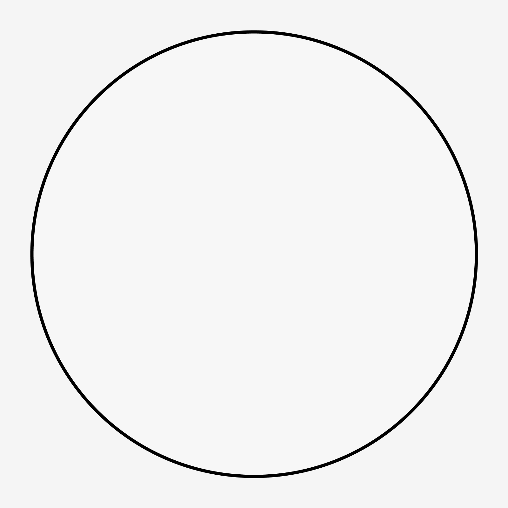
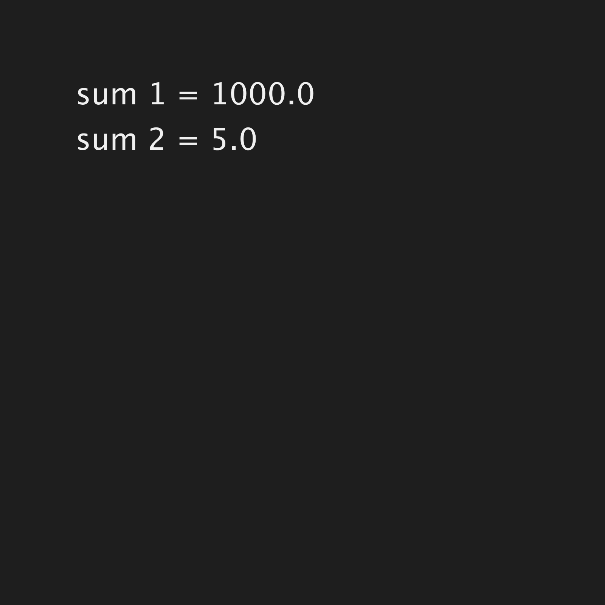
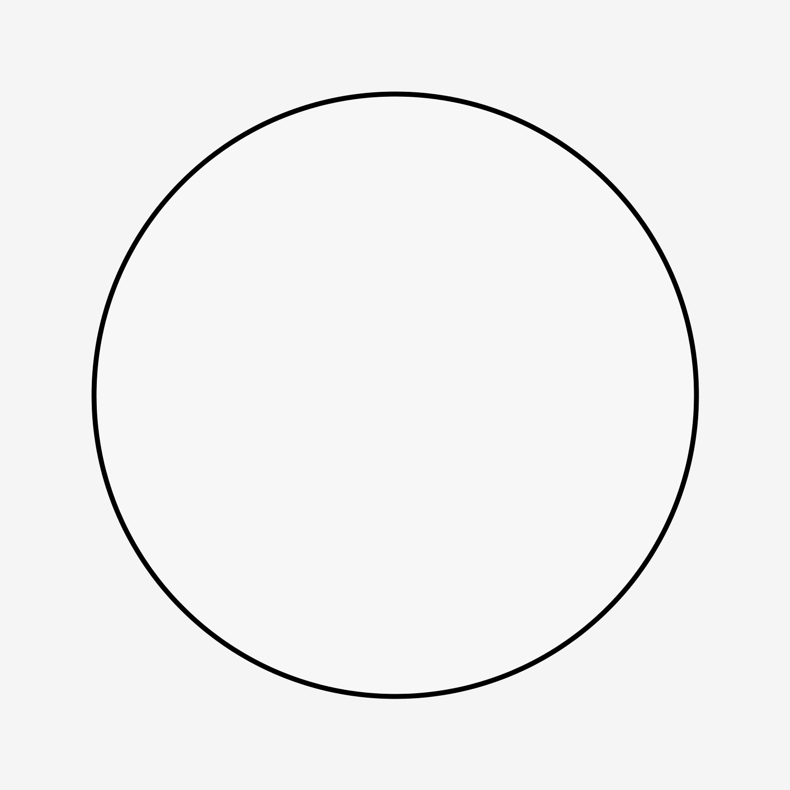
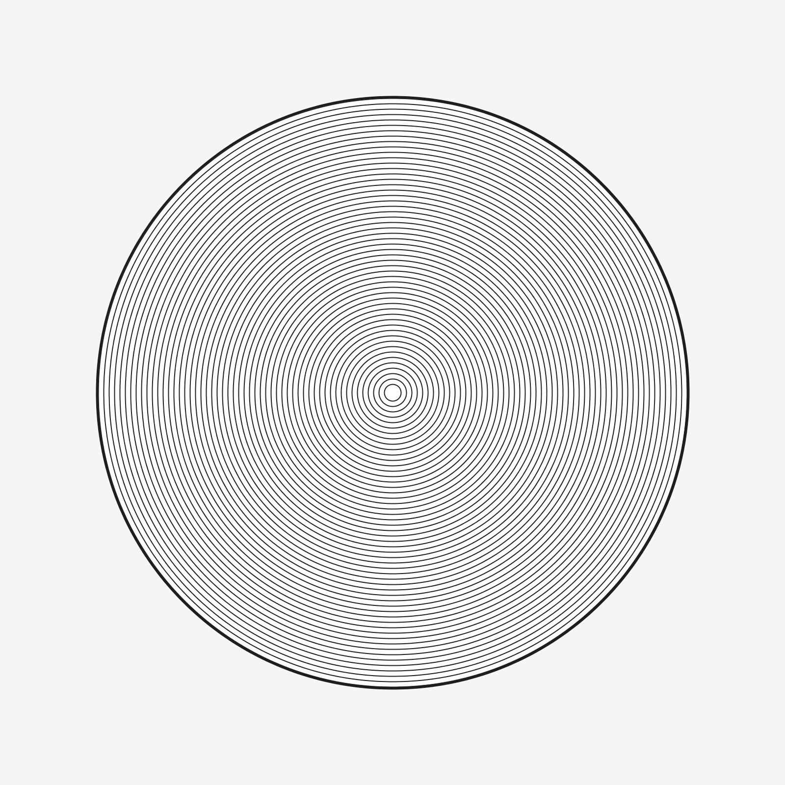
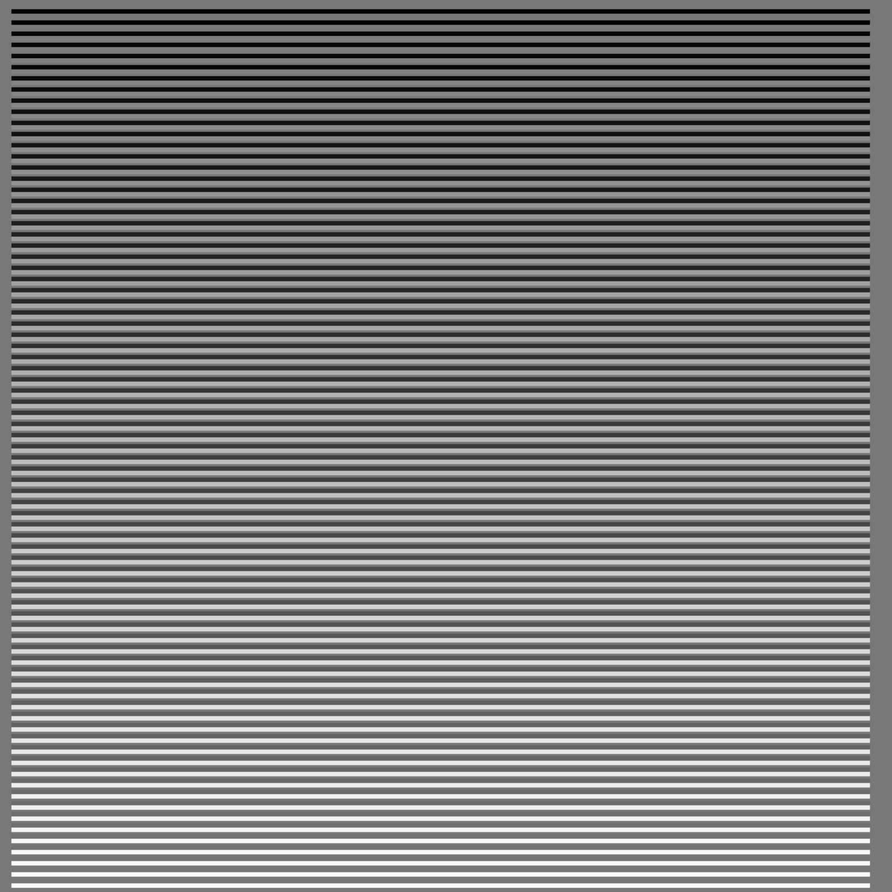

Chapter 2
 
[ ch2_1_2_HelloWorld](ch2_1_2_HelloWorld/export/ch2_1_2_HelloWorld.png)

[ ch2_2_1_Functions_Params_ColorValues](ch2_2_1_Functions_Params_ColorValues/export/ch2_2_1_Functions_Params_ColorValues.png)

[ ch2_2_3_Variables](ch2_2_3_Variables/export/ch2_2_3_Variables.png)

[ ch2_2_4_Fills_AlphaValues_DrawingOrder](ch2_2_4_Fills_AlphaValues_DrawingOrder/export/ch2_2_4_Fills_AlphaValues_DrawingOrder.png)

[ ch2_3_1_FrameLoop](ch2_3_1_FrameLoop/export/ch2_3_1_FrameLoop.png)

[ ch2_3_2_WriteOwnFunctions](ch2_3_2_WriteOwnFunctions/export/ch2_3_2_WriteOwnFunctions.png)

[ ch2_3_3_Operators](ch2_3_3_Operators/export/ch2_3_3_Operators.png)

[ ch2_3_4_Conditionals](ch2_3_4_Conditionals/export/ch2_3_4_Conditionals.png)

[ ch2_4_1_WhileLoops_v01](ch2_4_1_WhileLoops_v01/export/ch2_4_1_WhileLoops_v01.png)

[ ch2_4_1_WhileLoops_v02](ch2_4_1_WhileLoops_v02/export/ch2_4_1_WhileLoops_v02.png)

[ ch2_4_2_LeavingTracesv01](ch2_4_2_LeavingTracesv01/export/ch2_4_2_LeavingTracesv01.png)

[ ch2_4_2_LeavingTracesv02](ch2_4_2_LeavingTracesv02/export/ch2_4_2_LeavingTracesv02.png)

[ ch2_4_3_ForLoops](ch2_4_3_ForLoops/export/ch2_4_3_ForLoops.png)
